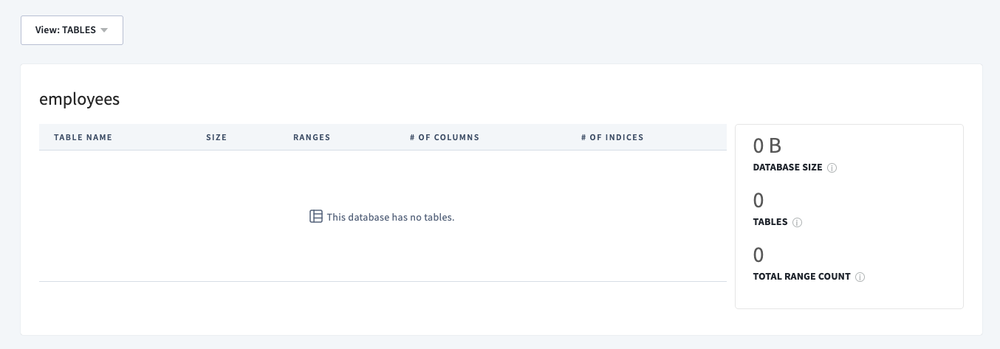

---
#Front matter (metadata).
abstract:               # REQUIRED

authors:
 - name: "Manoj Jahgirdar"
   email: "manoj.jahgirdar@in.ibm.com"
 - name: "Rahul Reddy Ravipally"
   email: "raravi86@in.ibm.com"
 - name: "Srikanth Manne"
   email: "srikanth.manne@in.ibm.com"
 - name: "Manjula G. Hosurmath"
   email: "mhosurma@in.ibm.com"

completed_date: 2020-01-20

components:
- slug: "cockroachdb"
  name: "CockroachDB"
  url: "https://marketplace.redhat.com/en-us/products/cockroachdb-operator"
  type: "component"
- slug: "redhat-marketplace"
  name: "Red Hat Marketplace"
  url: "https://marketplace.redhat.com/"
  type: "component"

draft: true|false       # REQUIRED

excerpt:                # REQUIRED

keywords:               # REQUIRED - comma separated list

last_updated:           # REQUIRED - Note: date format is YYYY-MM-DD

primary_tag:          # REQUIRED - Note: Choose only only one primary tag. Multiple primary tags will result in automation failure. Additional non-primary tags can be added below.

pta:                    # REQUIRED - Note: can be only one
# For a full list of options see https://github.ibm.com/IBMCode/Definitions/blob/master/primary-technology-area.yml
# Use the "slug" value found at the link above to include it in this content.
# Example (remove the # to uncomment):
 # - "cloud, container, and infrastructure"

pwg:                    # REQUIRED - Note: can be one or many
# For a full list of options see https://github.ibm.com/IBMCode/Definitions/blob/master/portfolio-working-group.yml
# Use the "slug" value found at the link above to include it in this content.
# Example (remove the # to uncomment):
# - "containers"

related_content:        # OPTIONAL - Note: zero or more related content
  - type: announcements|articles|blogs|patterns|series|tutorials|videos
    slug:

related_links:           # OPTIONAL - Note: zero or more related links
  - title:
    url:
    description:

runtimes:               # OPTIONAL - Note: Select runtimes from the complete set of runtimes below. Do not create new runtimes. Only use runtimes specifically in use by your content.
# For a full list of options see https://github.ibm.com/IBMCode/Definitions/blob/master/runtimes.yml
# Use the "slug" value found at the link above to include it in this content.
# Example (remove the # to uncomment):
 # - "asp.net 5"

series:                 # OPTIONAL
 - type:
   slug:

services:               # OPTIONAL - Note: please select services from the complete set of services below. Do not create new services. Only use services specifically in use by your content.
# For a full list of options see https://github.ibm.com/IBMCode/Definitions/blob/master/services.yml
# Use the "slug" value found at the link above to include it in this content.
# Example (remove the # to uncomment):
# - "blockchain"

subtitle:               # REQUIRED

tags:
# Please select tags from the complete set of tags below. Do not create new tags. Only use tags specifically targeted for your content. If your content could match all tags (for example cloud, hybrid, and on-prem) then do not tag it with those tags. Less is more.
# For a full list of options see https://github.ibm.com/IBMCode/Definitions/blob/master/tags.yml
# Use the "slug" value found at the link above to include it in this content.
# Example (remove the # to uncomment):
 # - "blockchain"

title:                  # REQUIRED

translators:             # OPTIONAL - Note: can be one or more
  - name:
    email:

type: tutorial

---

# Store and query unstructured JSON data from CockroachDB hosted on Red Hat Marketplace

In this tutorial, we will learn how to get unstructured JSON data from an API, store it in CockroachDB hosted on Red Hat Marketplace, and query the unstructured JSON data from the table using python runtime and Jupyter notebook.

# About CockroachDB Operator

CockroachDB is a ultra resilient, distributed SQL that can easily scale-out serializable transactions for your apps and services. It is cloud-native, architected to simplify scale and also guarantee consistent transactions across multiple regions and multiple clouds. [Learn more](https://marketplace.redhat.com/en-us/products/cockroachdb-operator).

# Learning objectives

When you have completed this tutorial, you will understand how to:

* Install CockroachDB Operator from Red Hat Marketplace on a OpenShift Cluster
* Create a CockroachDB cluster instance
* Create a user and database in CockroachDB
* Store and query unstructured JSON data from a third-party API in CockroachDB
* Manage CockroachDB cluster from the Cluster Overview page

# Estimated time

Completing this tutorial should take about 30 minutes.

# Pre-requisites

1. [Red Hat Marketplace Account](https://marketplace.redhat.com/en-us/registration/om).
2. [Red Hat OpenShift Cluster](https://cloud.ibm.com/kubernetes/catalog/create?platformType=openshift). 
3. [OC & kubectl CLI](https://docs.openshift.com/container-platform/3.6/cli_reference/get_started_cli.html).

# Steps

### Step 1: Install the CockroachDB Operator from Red Hat Marketplace on OpenShift Cluster

- Steps to Deploy CockroachDB Operator from Red Hat Marketplace on a OpenShift Cluster can be found here,
  - [Steps to Deploy CockroachDB Operator](https://github.com/IBM/rhm-operator-deployment-steps)

- Once you have successfully setup CockroachDB Operator on OpenShift Cluster we can create a database.

### Step 2: Create a user and database in CockroachDB

- Now, let's create a `user` and a `database`.

- Run the following command to spin up a CockroachDB client:

```bash
$ kubectl run -it --rm cockroach-client \
--image=cockroachdb/cockroach \
--restart=Never \
--command -- \
./cockroach sql --insecure --host=example-cockroachdb-public.cockroachdb-test
```

- This should run the CockroachDB client and take you to a `SQL Command Prompt` as shown. If you don't see a command prompt, try pressing enter.

```bash
root@example-cockroachdb-public.cockroachdb-test:26257/defaultdb>
```

- From the CockroachDB client, run the following commands:

  - Create a user `maxroach` as follows:
  <pre><code>root@example-cockroachdb-public.cockroachdb-test:26257/defaultdb> <b>CREATE USER IF NOT EXISTS maxroach;</b>
  CREATE USER 1

  Time: 9.580878ms
  </code></pre>
  
  - Create a database `employees` as follows:
  <pre><code>root@example-cockroachdb-public.cockroachdb-test:26257/defaultdb> <b>CREATE DATABASE employees;</b>
  CREATE DATABASE

  Time: 14.449525ms
  </code></pre>
  
  - Give our user, `maxroach`, permission to update our database, `employees` as follows:
  <pre><code>root@example-cockroachdb-public.cockroachdb-test:26257/defaultdb> <b>GRANT ALL ON DATABASE employees TO maxroach;</b>
  GRANT
  
  Time: 9.308095ms
  </code></pre>
  
- At this point we have a `user` and a `database`.

- Type `\q` to quit the client console as shown:
<pre><code>root@example-cockroachdb-public.cockroachdb-test:26257/defaultdb> <b>\q</b>
pod "cockroach-client" deleted
</code></pre>

### Step 3: Access the admin console on your localhost

- Let us view the results of the commands we ran in the earlier steps via the `admin console`. The console can be accessed at localhost with port forwarding.

- Run the following command to port forward `8080`:
```bash
$ kubectl port-forward example-cockroachdb-0 8080
```

```
Forwarding from 127.0.0.1:8080 -> 8080
Forwarding from [::1]:8080 -> 8080
```

- Visit <http://localhost:8080> on your browser as shown. The page should load the cluster overview.


- You can click on `databases` to view the `employees` database that we created earlier as shown.



### Step 4: Store and Query unstructured JSON data using python runtime and Jupyter Notebook

- Once we have the CockroachDB UP and running, user and database created, we can now explore the JSON support by CockroachDB in a python runtime using Jupyter Notebook.

- In Terminal run the following command to port forward `26257` port from the CockroachDB database instance which we will be using in our Jupyter Notebook to establish a connection with the CockroachDB database instance.

```bash
$ kubectl port-forward example-cockroachdb-0 26257
```

```
Forwarding from 127.0.0.1:26257 -> 26257
Forwarding from [::1]:26257 -> 26257
```

- We will be working with Jupyter Notebook, you can use tools like [Anaconda](https://www.anaconda.com/products/individual) to open the Jupyter Notebook or [install Jupyter Notebook from python-pip](https://jupyter.org/install).

- Download and open the notebook [Store-and-query-unstructured-Json-CockroachDB.ipynb](Store-and-query-unstructured-Json-CockroachDB.ipynb) in your local machine.

- We will be using <http://dummy.restapiexample.com/api/v1/employees> API for the demonstration purpose.


- Click on the **Cell** tab and click on **Run All** as shown.


- You can now follow the notebook instructions for more details on what is happening in each cell.

- After we have execuited the notebook, we can verify the table in the ClockroachDB instance through the CockroachDB client from terminal.

- In terminal Run the following command to spin up a CockroachDB client:

```bash
$ kubectl run -it --rm cockroach-client \
--image=cockroachdb/cockroach \
--restart=Never \
--command -- \
./cockroach sql --insecure --host=example-cockroachdb-public.cockroachdb-test
```

- This should run the CockroachDB client and take you to a `SQL Command Prompt` as shown. If you don't see a command prompt, try pressing enter.

```bash
root@example-cockroachdb-public.cockroachdb-test:26257/defaultdb>
```

- From the CockroachDB client, run the following commands to view `user`, `database` and `table` which was created with the Jupyter Notebook:

  - View `users` by running the `SHOW users;` command as follows:
  <pre><code>root@example-cockroachdb-public.cockroachdb-test:26257/defaultdb> <b>SHOW users;</b>
   user_name
  `-------------`
    cpuser
    <b>maxroach</b>
    root
  (3 rows)

  Time: 3.037641ms
  </code></pre>

  - View `databases` by running the `SHOW databases;` command as follows:
  <pre><code>root@example-cockroachdb-public.cockroachdb-test:26257/defaultdb> <b>SHOW databases;</b>
  database_name
  `-----------------`
  bank
  defaultdb
  <b>employees</b>
  postgres
  system
  (5 rows)

  Time: 2.890031ms</code></pre>

  - To view the tables present in `employees` database, run the `USE bank;` command to switch to `bank` database, and run `\d` command to view the `tables` as follows:
  <pre><code>root@example-cockroachdb-public.cockroachdb-test:26257/defaultdb> <b>USE employees;</b>
  SET

  Time: 11.83841ms

  root@example-cockroachdb-public.cockroachdb-test:26257/employees> <b>\d</b>
  table_name
  `----------------------`
  <b>jsontbl</b>
  (1 row)

  Time: 3.684617ms</code></pre>

  - Finally to view the unstructured JSON from the table run the `SELECT` command as follows:
  <pre><code>root@example-cockroachdb-public.cockroachdb-test:26257/employees> <b>SELECT * from jsontbl;</b>
  </code></pre>

  

# Summary

We learn't how to get unstructured JSON data from a third-party REST API, created a table in CockroachDB and store the unstructured JSON data into the table. We also learn't to query the unstructured data from CockroachDB table into a pandas dataframe which can be further used for data engineering and data science tasks.

# Reference

You can refer the following documentation from [Cockroach labs](https://www.cockroachlabs.com) to learn more about the operator and its features.
  - https://www.cockroachlabs.com/docs/stable/demo-json-support.html
