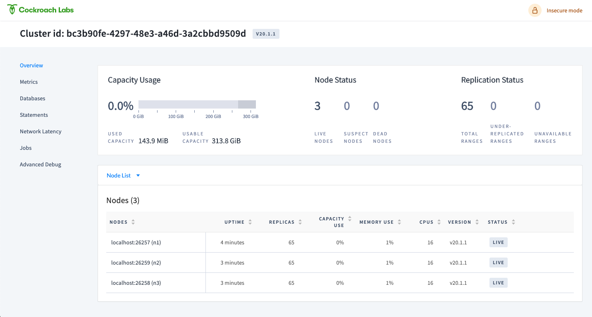

---
#Front matter (metadata).
abstract: "This tutorial shows you how to get unstructured JSON data from an API, store it in CockroachDB hosted on Red Hat Marketplace, and query the unstructured JSON data from the table using Python and a Jupyter notebook."

excerpt:  "This tutorial shows you how to get unstructured JSON data from an API, store it in CockroachDB hosted on Red Hat Marketplace, and query the unstructured JSON data from the table using Python and a Jupyter notebook."

authors:
 - name: "Manoj Jahgirdar"
   email: "manoj.jahgirdar@in.ibm.com"
 - name: "Rahul Reddy Ravipally"
   email: "raravi86@in.ibm.com"
 - name: "Srikanth Manne"
   email: "srikanth.manne@in.ibm.com"
 - name: "Manjula G. Hosurmath"
   email: "mhosurma@in.ibm.com"

completed_date: 2020-09-03
last_updated: 2020-09-03

components:
- slug: "cockroachdb"
  name: "CockroachDB"
  url: "https://marketplace.redhat.com/en-us/products/cockroachdb-operator"
  type: "component"
- slug: "redhat-marketplace"
  name: "Red Hat Marketplace"
  url: "https://marketplace.redhat.com/"
  type: "component"

draft: true

keywords: "cockroachdb, red hat marketplace"

primary_tag:  "databases"

related_content:
  - type: tutorials
    slug: get-started-using-a-cockroachdb-operator-hosted-on-red-hat-marketplace

# related_links:           # OPTIONAL - Note: zero or more related links
#  - title:
#    url:
#    description:

title:  "Store and query unstructured JSON data from CockroachDB hosted on Red Hat Marketplace"
subtitle: "Access JSON data with CockroachDB and OpenShift"

tags:
 - "databases"
 - "containers"


translators:             # OPTIONAL - Note: can be one or more
  - name:
    email:

type: tutorial

---

This tutorial shows you how to get unstructured JSON data from an API, store it in CockroachDB hosted on Red Hat Marketplace, and query the unstructured JSON data from the table using Python and Jupyter notebooks.

# About CockroachDB Operator

CockroachDB is an elastic SQL database that easily scales transactions for your apps and services. Its cloud-native architecture simplifies scale and also guarantees consistent transactions across multiple regions and multiple clouds. [Learn more](https://marketplace.redhat.com/en-us/products/cockroachdb-operator).

# Learning objectives

When you have completed this tutorial, you will understand how to:

* Install CockroachDB Operator from Red Hat Marketplace on an OpenShift Cluster
* Create a CockroachDB cluster instance
* Create a user and database in CockroachDB
* Store and query unstructured JSON data from a third-party API in CockroachDB
* Manage the CockroachDB cluster from the Cluster Overview page

# Estimated time

Completing this tutorial should take about 30 minutes.

# Pre-requisites

1. [Red Hat Marketplace account](https://marketplace.redhat.com/en-us/registration/om).
2. [Red Hat OpenShift Cluster](https://cloud.ibm.com/kubernetes/catalog/create?platformType=openshift). <--EM: this is different than the doc we referenced in the Get Started tutorial we just did. We linked here: https://cloud.ibm.com/docs/openshift?topic=openshift-getting-started when telling readers to set up a RH cluster-->
3. [OC & kubectl CLI](https://docs.openshift.com/container-platform/3.6/cli_reference/get_started_cli.html).<!--EM: this link is outdated. Is it okay to point here? And what does "OC" stand for? https://docs.openshift.com/container-platform/3.11/welcome/index.html-->
4. Access to a Jupyter Notebook. You can [install a Jupyter Notebook from python-pip](https://jupyter.org/install) or use a tool such as [Anaconda](https://www.anaconda.com/products/individual) to open the Jupyter Notebook.

# Steps

### Step 1: Install the CockroachDB Operator from Red Hat Marketplace on OpenShift Cluster

- Follow the steps in this tutorial to deploy a CockroachDB Operator from Red Hat Marketplace on an OpenShift Cluster:
  - [Get started using a CockroachDB Operator hosted on Red Hat Marketplace](https://developer.ibm.com/tutorials/get-started-using-a-cockroachdb-operator-hosted-on-red-hat-marketplace/)

Once you have successfully set up a CockroachDB Operator on an OpenShift Cluster you can create a database.

### Step 2: Create a user and database in CockroachDB

Now, let's create a `user` and a `database`.

1. Run the following command to spin up a CockroachDB client: <!--EM: Is this just from their terminal?-->

    ```bash
    $ kubectl run -it --rm cockroach-client \
    --image=cockroachdb/cockroach \
    --restart=Never \
    --command -- \
    ./cockroach sql --insecure --host=example-cockroachdb-public.cockroachdb-test
    ```

    This should run the CockroachDB client and take you to a `SQL Command Prompt` as shown. If you don't see a command prompt, try pressing Enter.

    ```bash
    root@example-cockroachdb-public.cockroachdb-test:26257/defaultdb>
    ```

1. From the CockroachDB client, run the following commands:

    * Create a user `maxroach` as follows:
  
    <pre><code>root@example-cockroachdb-public.cockroachdb-test:26257/defaultdb> <b>CREATE USER IF NOT EXISTS maxroach;</b>
    CREATE USER 1

    Time: 9.580878ms
    </code></pre>
  
    * Create a database `employees` as follows:
 
    <pre><code>root@example-cockroachdb-public.cockroachdb-test:26257/defaultdb> <b>CREATE DATABASE employees;</b>
    CREATE DATABASE

    Time: 14.449525ms
    </code></pre>
  
    * Give the user, `maxroach`, permission to update our database, `employees`, as follows:
  
    <pre><code>root@example-cockroachdb-public.cockroachdb-test:26257/defaultdb> <b>GRANT ALL ON DATABASE employees TO maxroach;</b>
    GRANT
  
    Time: 9.308095ms
    </code></pre>
  
    At this point, you should have a `user` and a `database`.

1. Type `\q` to quit the client console as shown:

    <pre><code>root@example-cockroachdb-public.cockroachdb-test:26257/defaultdb> <b>\q</b>
    pod "cockroach-client" deleted
    </code></pre>

### Step 3: Access the admin console on your localhost

The following steps show you how to view the results of the commands you ran in the earlier steps via the `admin console` <!--EM: is this something that the reader has to login? Is the console part of cockroachdb or RHM?-->. You can access the console at localhost with port forwarding.

1. Run the following command to port forward `8080`:

    ```bash
    $ kubectl port-forward example-cockroachdb-0 8080
    ```

    ```
    Forwarding from 127.0.0.1:8080 -> 8080
    Forwarding from [::1]:8080 -> 8080
    ```

1. Visit <http://localhost:8080> on your browser as shown. The page should load the cluster overview.

    

1. Click on `databases` to view the `employees` database that you created earlier.

    

### Step 4: Store and query unstructured JSON data using Python and Jupyter Notebooks

Once the CockroachDB is running and you created the user and database, you can now explore the JSON support for CockroachDB in a python runtime using Jupyter Notebook.

1. In your terminal, run the following command to port forward the `26257` port from the CockroachDB database instance. This port is used in your Jupyter Notebook to establish a connection with the CockroachDB database instance.

    ```bash
    $ kubectl port-forward example-cockroachdb-0 26257
    ```

    ```
    Forwarding from 127.0.0.1:26257 -> 26257
    Forwarding from [::1]:26257 -> 26257
    ```

1. Download and open the notebook [Store-and-query-unstructured-Json-CockroachDB.ipynb](Store-and-query-unstructured-Json-CockroachDB.ipynb) in your local machine. <!--EM: Where do they access this notebook? Is it on our public IBM GH?--> 

    We are using the <http://dummy.restapiexample.com/api/v1/employees> API for demonstration purpose.

    

1. Click on the **Cell** tab and select **Run All**.

    

    You can now follow the notebook instructions for more details on what is happening in each cell.

    After you have executed the notebook, verify the table in the CockroachDB instance through the CockroachDB client from terminal.

1. In your terminal, run the following command to spin up a CockroachDB client:

    ```bash
    $ kubectl run -it --rm cockroach-client \
    --image=cockroachdb/cockroach \
    --restart=Never \
    --command -- \
    ./cockroach sql --insecure --host=example-cockroachdb-public.cockroachdb-test
    ```

    This should run the CockroachDB client and take you to a `SQL Command Prompt` as shown. If you don't see a command prompt, try pressing Enter.

    ```bash
    root@example-cockroachdb-public.cockroachdb-test:26257/defaultdb>
    ```

1. From the CockroachDB client, run the following commands to view the `user`, `database`, and `table` which the Jupyter Notebook created:

    * View `users` by running the `SHOW users;` command:
  
      <pre><code>root@example-cockroachdb-public.cockroachdb-test:26257/defaultdb> <b>SHOW users;</b>
       user_name
      `-------------`
        cpuser
        <b>maxroach</b>
        root
        (3 rows)

      Time: 3.037641ms
      </code></pre>

    * View `databases` by running the `SHOW databases;` command:
  
      <pre><code>root@example-cockroachdb-public.cockroachdb-test:26257/defaultdb> <b>SHOW databases;</b>
      database_name
      `-----------------`
      bank
      defaultdb
      <b>employees</b>
      postgres
      system
      (5 rows)

      Time: 2.890031ms</code></pre>

    * To view the tables present in the Employees database, run the `USE bank;` command to switch to `bank` database, and run `\d` command to view the `tables`:
  
      <pre><code>root@example-cockroachdb-public.cockroachdb-test:26257/defaultdb> <b>USE employees;</b>
      SET

      Time: 11.83841ms

      root@example-cockroachdb-public.cockroachdb-test:26257/employees> <b>\d</b>
      table_name
      `----------------------`
      <b>jsontbl</b>
      (1 row)

      Time: 3.684617ms</code></pre>

  1. Finally, to view the unstructured JSON from the table, run the `SELECT` command as follows:

    <pre><code>root@example-cockroachdb-public.cockroachdb-test:26257/employees> <b>SELECT * from jsontbl;</b>
    </code></pre>

    

# Summary

In this tutorial, we showed you how to get unstructured JSON data from a third-party REST API, created a table in CockroachDB and store the unstructured JSON data into the table. You also learned how to query the unstructured data from CockroachDB table into a pandas dataframe which can be further used for data engineering and data science tasks.

# Reference

Refer to the following documentation from [Cockroach labs](https://www.cockroachlabs.com) to learn more about the operator and its features.
  - https://www.cockroachlabs.com/docs/stable/demo-json-support.html
